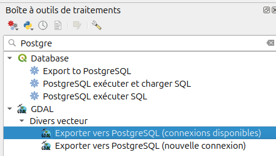
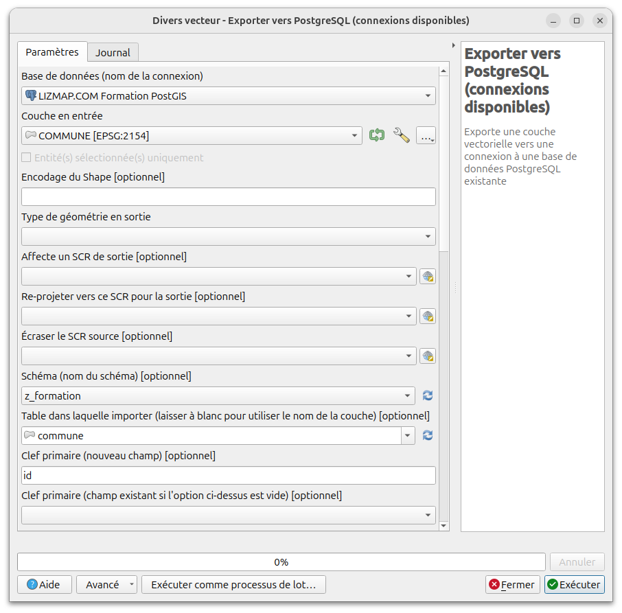

# Importer des données

Pour la formation, on doit **importer des données** pour pouvoir travailler.

## Import d'une couche depuis QGIS

On doit **charger au préalable la couche source** dans QGIS (SHP, TAB, etc.), puis on doit **vérifier** :

* la **projection**, idéalement `EPSG:2154`
* l'**encodage** : `UTF-8`, `ISO-8859-15`, etc. Il faut ouvrir la **table attributaire**, et vérifier si les accents sont bien affichés. Sinon choisir le bon encodage dans l'onglet **Général** des **propriétés de la couche**
* les **champs**: noms, type, contenu

Pour importer, il existe plusieurs manières dans QGIS. La plus **performante** pour des gros volumes de données est l'utilisation de l'algorithme de la `boîte à outils` du menu `Traitement`  appelé `Exporter vers PostgreSQL (Connexions disponibles`.

Pour trouver cet algorithme, chercher `PosgreSQL` dans le champ du haut, et lancer l'algorithme **Exporter vers PostgreSQL (connexions disponibles)** de **GDAL**. Il faut choisir les options suivantes :

* choisir la bonne **connexion**, la couche en entrée, etc.
* choisir le **schéma**, par exemple `z_formation`
* choisir le **nom de la table**, par exemple `commune`
* laisser `id` dans le champ **Clef primaire** si aucun champ entier auto-incrémenté existe, ou choisir le champ approprié
* décocher **Convertir en morceaux multiples** pour les couches de points (et aussi pour les lignes et polygones si on est sûr)
* laisser le reste par défaut.

Après l'import, on peut charger la table comme une couche via **l'explorateur de QGIS** :

* **rafraîchir** le contenu du schéma via clic-droit et `Rafraîchir`
* **double-cliquer** sur la table

## Importer plusieurs couches en batch

Il est possible d'utiliser l'outil **Importer un vecteur vers une base de données PostGIS (connexions disponibles)** par lot. Pour cela, une fois la boîte de dialogue de cet algorithme ouverte, cliquer sur le bouton **Exécuter comme processus de lot**. Cela affiche un tableau, ou chaque ligne représente les variables d'entrée d'un algorithme.

Vous pouvez créer manuellement chaque ligne, ou choisir directement les couches depuis votre projet QGIS. Voir la documentation QGIS pour plus de détail:
https://docs.qgis.org/latest/fr/docs/user_manual/processing/batch.html

Continuer vers [Sélectionner des données : SELECT](./sql_select.md)
