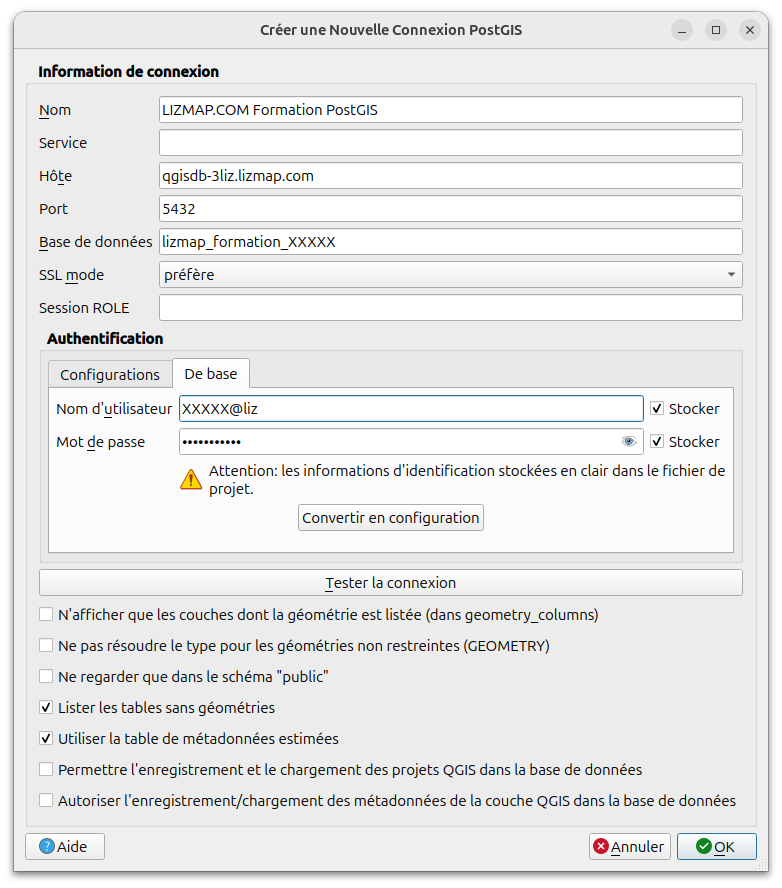
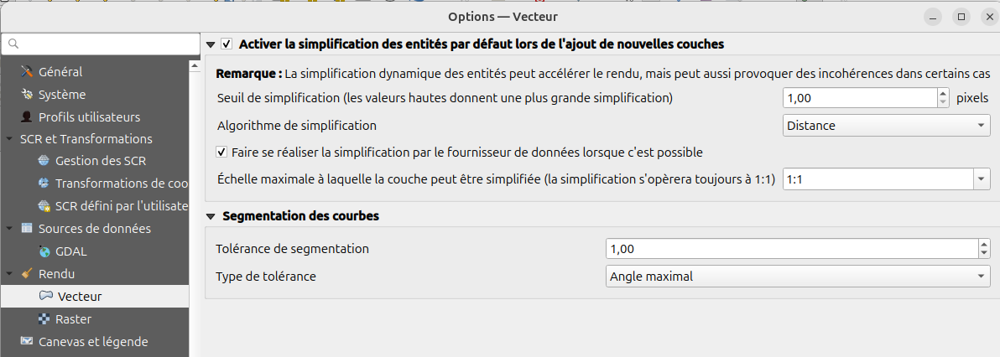
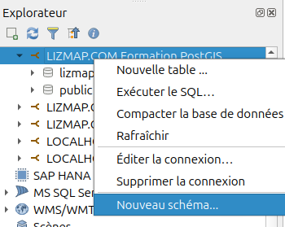
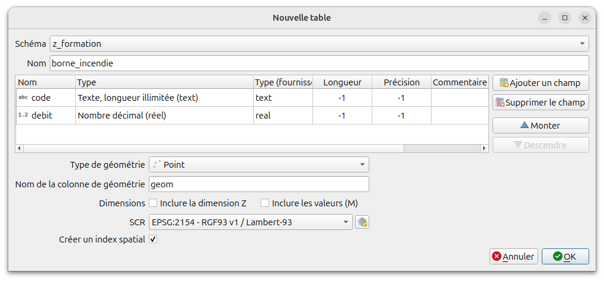

# Gestion des données PostgreSQL dans QGIS

## Introduction

Lorsqu'on travaille avec des données **PostgreSQL**, QGIS n'accède pas à la donnée en lisant un ou plusieurs fichiers, mais fait des **requêtes** à la base, à chaque fois qu'il en a besoin: déplacement de carte, zoom, ouverture de la table attributaire, sélection par expression, etc.

* QGIS **se connecte** à la base de données, et récupère des données qui sont stockées dans des tables. Il doit donc **télécharger la donnée** à chaque action (pas de cache car la donnée peut changer entre temps).
* une **table** équivaut à une **couche SIG**, définie par un nom, une **liste de champs typés**, et un ou plusieurs champs de **géométrie**.
* une **géométrie** est caractérisée par un **type** (polygone, point, ligne, etc.), une **dimension** (2D ou 3D) et une **projection** (Ex: EPSG:2154) codifiée via un SRID (Ex: 2154)
* certaines tables n'ont pas de géométrie: on les appelle alors **non spatiales**. QGIS sait les exploiter, ce qui permet de stocker des informations de contexte (nomenclature, événements).

La base de données fournit donc un lieu de stockage des données centralisé. On peut gérer les droits d'accès ou d'écriture sur les schémas et les tables.


## Créer une connexion QGIS à la base de données

Dans QGIS, il faut **créer une nouvelle connexion** à PostgreSQL, via l'outil "Éléphant" : menu **Couches / Ajouter une couche / Ajouter une couche PostgreSQL**. Configurer les options suivantes :

* laisser le champ **Service** vide (sauf si vous savez utiliser les fichiers de service PostgreSQL, ce qui est recommandé)
* cocher les cases **Enregistrer** à côté de l'utilisateur et du mot de passe, après avoir **Tester la connexion** (via le bouton dédié)
* cocher les cases en bas **Lister les tables sans géométries** et **Utiliser la table de métadonnées estimées**
* Valider



**Attention** Pour plus de sécurité, privilégier l'usage d'un service PostgreSQL:
https://docs.qgis.org/latest/fr/docs/user_manual/managing_data_source/opening_data.html#pg-service-file (plugin QGIS intéressant : PG Service Parser)

Il est aussi intéressant pour les **performances** d'accès aux données PostgreSQL de modifier une option dans les options de QGIS, onglet **Rendu** : il faut cocher la case **Réaliser la simplification par le fournisseur de données lorsque c'est possible**. Cela permet de télécharger des versions allégées des données aux petites échelles. [Documentation QGIS](https://docs.qgis.org/latest/fr/docs/user_manual/introduction/qgis_configuration.html#rendering-settings)



**NB** Pour les couches PostGIS qui auraient déjà été ajoutées **avant d'avoir activé cette option**, vous pouvez manuellement changer dans vos projets via l'onglet **Rendu** de la boîte de dialogue des propriétés de chaque couche PostGIS.


## Ouvrir une couche PostgreSQL dans QGIS

Trois solutions sont possibles :

* **utiliser l'explorateur** : Le panneau présente un arbre qui liste les `schémas`, puis les `tables` ou `vues` exploitables. Une icône devant chaque table/vue indique si une table est géométrique ou non ainsi que le type de géométrie, point, ligne ou polygone. On peut utiliser le menu `Clic-Droit` sur les objets de l'arbre.
* utiliser le menu **Couche / Ajouter une couche**. La boite de dialogue propose de se connecter, puis liste les schémas et les tables (ancienne méthode pas recommandée)
* utiliser le **Gestionnaire de base de données**, qui présente une fenêtre QGIS séparée dédiée aux manipulations sur les données.

## Création de schémas et de tables

On peut travailler avec le gestionnaire de bases de données de QGIS : menu **Base de données > Gestionnaire BD** (sinon via l'icône de la barre d’outil base de données) ou avec l'**explorateur** (recommandé).

Dans l'arbre qui se présente, on peut **choisir sa connexion**, puis double-cliquer, ce qui montre l'ensemble des **schémas**, et l'ouverture d'un schéma montre la liste des tables et vues. Les menus permettent de créer ou d'éditer des objets (schémas, tables).

Une **fenêtre SQL** permet de lancer manuellement des requêtes SQL. Nous allons principalement utiliser cet outil : menu **Base de données / Fenêtre SQL** (on peut aussi le lancer via F2).

NB: C'est possible aussi d'utiliser le **fenêtre SQL de l'explorateur** via clic-droit `Exécuter le SQL ...`, mais elle ne permet pas encore de ne lancer que le **texte surligné**, ce qui est pourtant très pratique pendant une formation.

### Création du schéma

Les **schémas** dans une base PostgreSQL sont utiles pour regrouper les tables.

On recommande de ne pas créer de tables dans le schéma `public`, mais d'utiliser des schémas (par thématique, pour la gestion des droits, etc.).

Pour la formation, nous allons créer un schéma `z_formation` :

* Dans l'explorateur, faire un clic-droit sur le nom de la connexion et `Créer un schéma`.



### Création d'une table

Ensuite, on peut créer une **table** dans ce schéma : dans l'explorateur, faire un clic-droit sur le schéma `z_formation`, puis `Nouvelle table...` :

* choisir le **schéma** et le **nom** de la table, en minuscule, sans accents ni caractères complexes
* Via le bouton **Ajouter un champ**, on crée autant de champs que nécessaire en choisissant le nom et le type. **Choisir des noms de champ simples sans majuscule, espace ni accents !**.
* Choisir dans la liste déroulante le **champ de clé primaire** (ici id)
* Cocher **Créer une colonne géométrique** et choisir le type et le SRID (par exemple 2154 pour le Lambert 93)
* Cocher **Créer un index spatial**




**NB**: on a créé une table dans cet exemple `z_formation.borne_incendie` avec les champs **code** (text), **debit** (real) et **geom** (géométrie de type Point, code SRID 2154)

* Un champ `id` de type **entier auto-incrémenté** a été créé automatiquement par QGIS en tant que **clé primaire** de la table.
* Un **index spatial** a aussi été créé par QGIS sur le champ de géométrie.

### Utiliser du SQL au lieu des menus de QGIS

On peut aussi utiliser du **SQL** pour créer des objets dans la base :

```sql
-- création d'un schéma
CREATE SCHEMA IF NOT EXISTS z_formation;

-- création de la table
CREATE TABLE IF NOT EXISTS z_formation.borne_incendie (
    -- un serial est un entier auto-incrémenté
    id_borne serial NOT NULL PRIMARY KEY,
    code text NOT NULL,
    debit real,
    geom geometry(Point, 2154)
);
-- Création de l'index spatial
DROP INDEX IF EXISTS borne_incendie_geom_idx;
CREATE INDEX ON z_formation.borne_incendie USING GIST (geom);

```

### Ajouter des données dans une table

On peut bien sûr charger la table dans QGIS, puis utiliser les **outils d'édition** classique pour créer des nouveaux objets ou les modifier.

En SQL, il est aussi possible d'insérer des données ( https://sql.sh/cours/insert-into ). Par exemple pour les bornes à incendie :


```sql
INSERT INTO z_formation.borne_incendie (code, debit, geom)
 VALUES
 ('ABC',  1.5, ST_SetSRID(ST_MakePoint(490846.0,6936902.7), 2154)),
 ('XYZ',  4.1, ST_SetSRID(ST_MakePoint(491284.9,6936551.6), 2154)),
 ('FGH',  2.9, ST_SetSRID(ST_MakePoint(490839.8,6937794.8), 2154)),
 ('IOP',  3.6, ST_SetSRID(ST_MakePoint(491203.3,6937488.1), 2154))
;
```

**NB**: Nous verrons plus loin l'utilisation de fonctions de création de géométrie, comme **ST_MakePoint**


## Vérifier et créer les indexes spatiaux

On peut vérifier si chaque table contient un **index spatial** via le gestionnaire de base de données de QGIS, en cliquant sur la table dans l'arbre, puis en regardant les informations de l'onglet **Info**. On peut alors créer l'index spatial via le lien bleu **Aucun index spatial défini (en créer un)**.

Sinon, il est possible de le faire en SQL via la requête suivante :

```sql
CREATE INDEX ON nom_du_schema.nom_de_la_table USING GIST (geom);
```

Si on souhaite automatiser la création des indexes pour toutes les tables qui n'en ont pas, on peut utiliser une fonction, décrite dans la partie [Fonctions utiles](./utils.md)

Continuer vers l'[Import des données dans PostgreSQL](./import_data.md)
